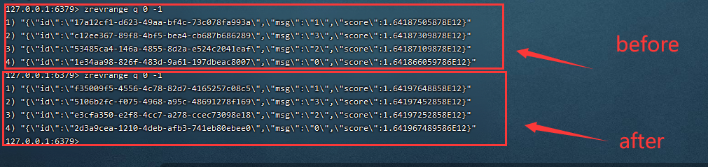
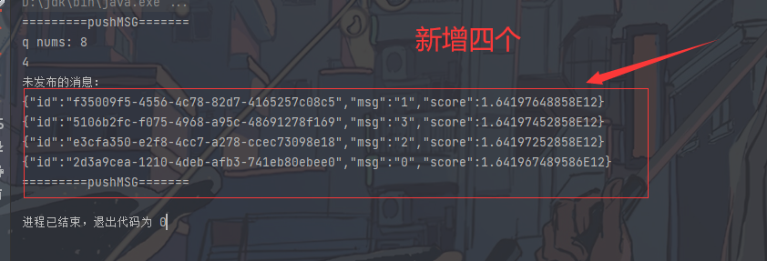

# DelayingQueue
基于Redis实现延时消息队列

## 运行前需要IDEA安装lombok

@[TOC](目录)


<hr style=" border:solid; width:100px; height:1px;" color=#000000 size=1">


# 一、基本原理


将延迟任务加到Sorted Set，将延迟时间设为score；启动一个线程不断判断Sorted Set中第一个元素的score是否小于当前时间，如果小于，从Sorted Set中移除任务并添加到执行队列中；如果大于，进行短暂休眠后，重复上诉操作。

<hr/>

# 二、实现步骤


<font color=#999AAA ></font>

1.	在对于一个消息的创建进入Redis缓存之中，消息的元素的score设置为当前的时间戳或发布时间戳或过期时间。

2.	开启执行轮询Redis的延时队列操作，获取队列的订单的标识，判断当前订单的score如果小于当前时间毫秒值，移除Redis队列中该消息。
3.	一直重复上诉操作。

## 消息订单类：

```java
public class Msg {
	// 消息id
    private String id;
	// 消息分数
    private double score;
	// 消息内容
    private String msg;

}
```

## 存入消息数据


```java
public static void putMSG(Jedis jedis){
		//将信息存入redis的消息zsorted队列  （分数自定义）分数 ==  （当前时间 + 多少秒 = 过期时间)
        Msg msg0 = new Msg(UUID.randomUUID().toString(),System.currentTimeMillis()+1006,"0");
        Msg msg1 = new Msg(UUID.randomUUID().toString(), System.currentTimeMillis() + 9000000,"1");
        Msg msg2 = new Msg(UUID.randomUUID().toString(), System.currentTimeMillis() + 5040000,"2");
        Msg msg3 = new Msg(UUID.randomUUID().toString(), System.currentTimeMillis() + 7040000,"3");
        // 将消息放入key 为 q 队列
//        System.out.println("===========MSG=====");
        jedis.zadd("q",msg0.getScore(), JSON.toJSONString(msg0));
        jedis.zadd("q",msg1.getScore(), JSON.toJSONString(msg1));
        jedis.zadd("q",msg2.getScore(), JSON.toJSONString(msg2));
        jedis.zadd("q",msg3.getScore(), JSON.toJSONString(msg3));
//        System.out.println("===========MSG=====");
    }
```
## 消费信息

```java
public class PushMsg {


    public void pushMSG(Jedis jedis) {

        System.out.println("=========pushMSG=======");
        System.out.println("q nums: " + jedis.zcard("q"));
        // 当前时间
        long now = System.currentTimeMillis();
        // 删除过期的消息
        jedis.zremrangeByScore("q", 0, now);
		// 获取未过期的信息
        Set<String> values = jedis.zrevrange("q", 0, -1 );
        System.out.println(values.size());
        System.out.println("未发布的消息：");
        for (String v:  values
             ) {
            System.out.println(v);
        }
        System.out.println("=========pushMSG=======");
    }
}


```
## 主函数
```java
    public static void main(String[] args) {

		//连接redis
        Jedis jedis = new Jedis("127.0.0.1", 6379);
        // 设置连接密码
        // jedis.auth("123");
		// 放入消息
        putMSG(jedis);
		// 消费消息
        PushMsg pushMsg = new PushMsg();
        pushMsg.pushMSG(jedis);
//        System.out.println("========");
    }

```


## 运行前后的redis服务器的数据

 
## 控制台输出

## 总结
应该一直运行的，然后效果会好些，然后消息过期时间设置合理一些。更加直观一些。
<hr style=" border:solid; width:100px; height:1px;" color=#000000 size=1">
